# Flask List
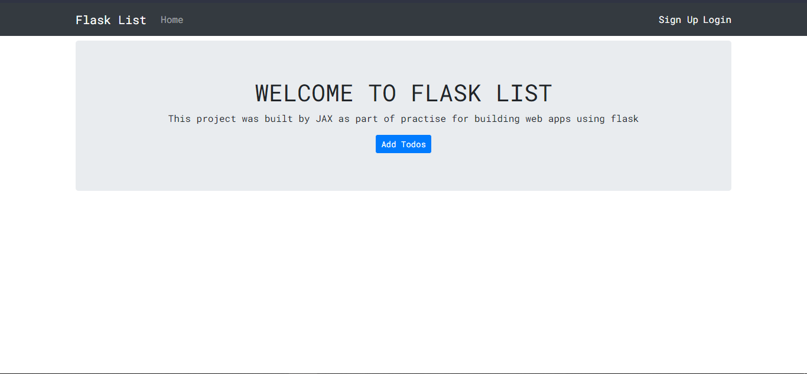

## Description
Flask List is a Web app that helps in managing tasks/todos. It perfoms various **CRUD** functions like **adding** tasks, **editing** and **deleting** tasks.

One has to create an account to perfom functions with the app.

## Technologies
* HTML
* Boostrap 4
* Python Flask
* SQLAlchemy
* SQLite

## Requirements
1. Python
1. Flask

## Installation
1. Run `git clone https://github.com/JacobJax/Flask-List.git`
1. Run `pip install -r requirements.txt`
1. Then you can now run `python main.py` to view the app on `localhost/5000`

## Usage
You can easily start using the app by clicking **Add Todos**

### **Creating account**
If you are not logged in, you will be directed to the log in page

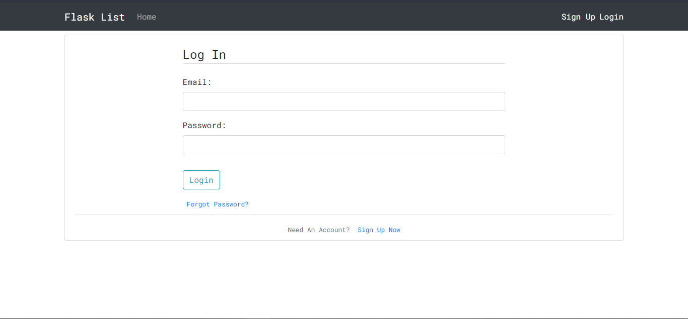

If you don't have an account click on the _**here**_ prompt to create a new account.

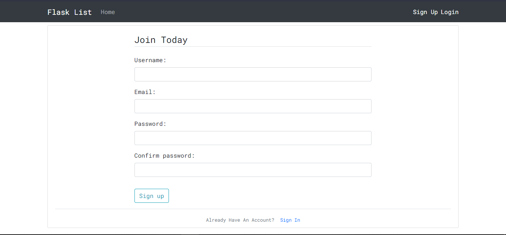 
Enter your details and click _**Sign up**_ to create an account.

Clicking _**Sign up**_ will redirect you to the log in page

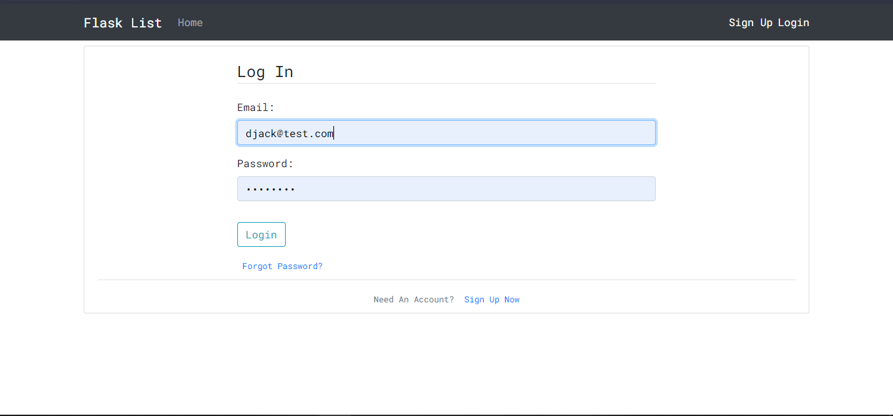

Enter your details to log in

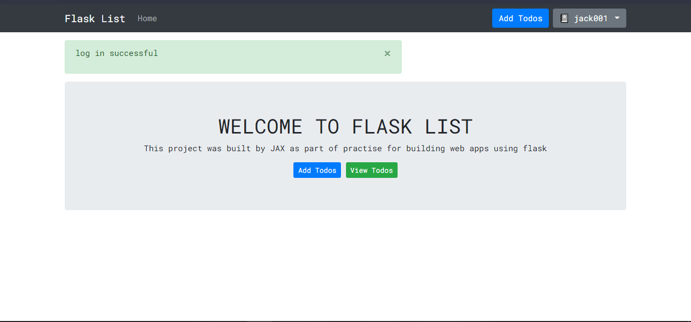

### **Adding tasks**
Click on _**Add Todos**_

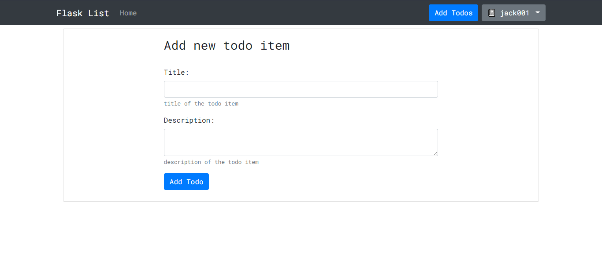

Enter task details and click _**Add Todo**_ to add the task

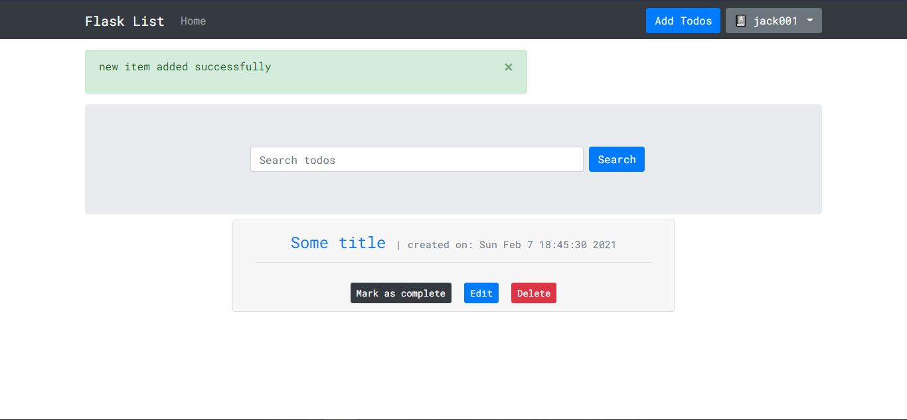

You can view the task description by clicking on the task

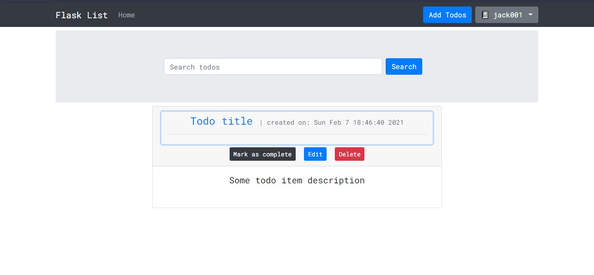

### **Editing tasks**
Click on _**Edit**_, on the edit page, enter new task details

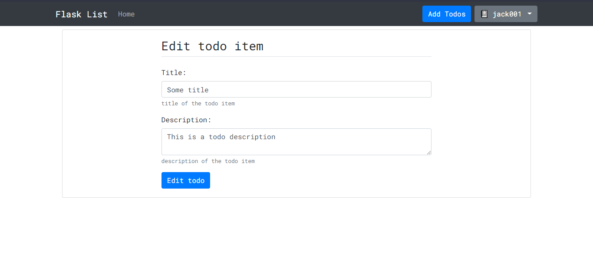

Click _**Edit todo**_

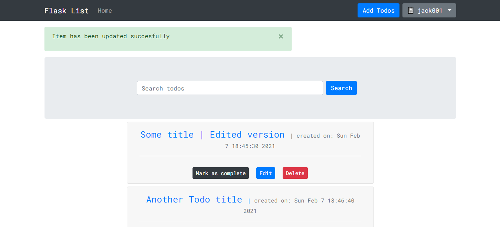

### **Deleting tasks**
Click on _**Delete**_

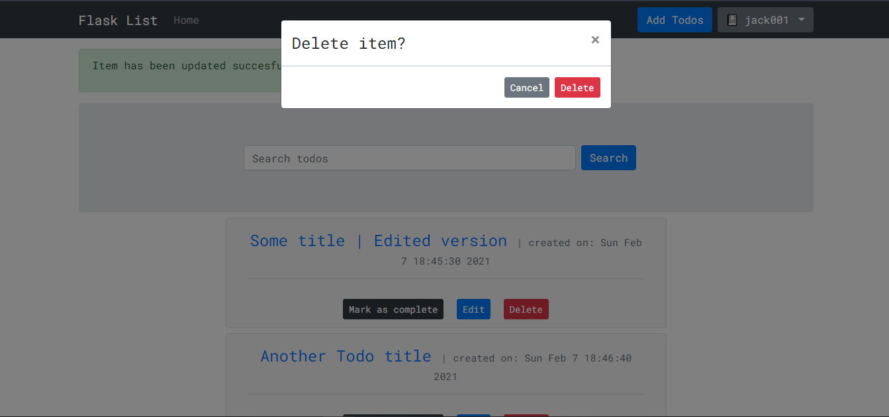

Click _**Delete**_ to confirm

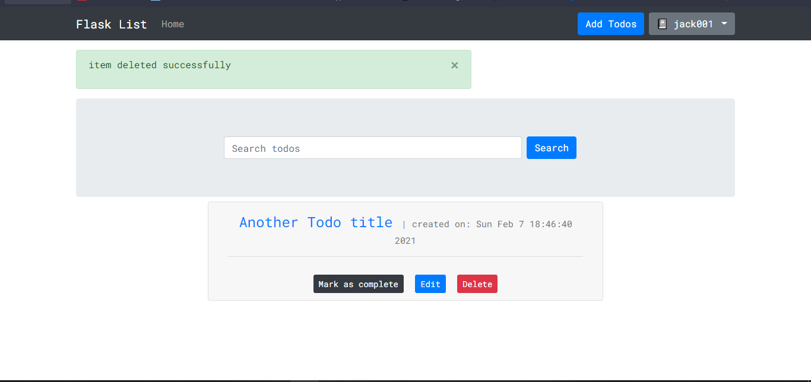

### **Logging Out**
Click on the dropdown with your username. 

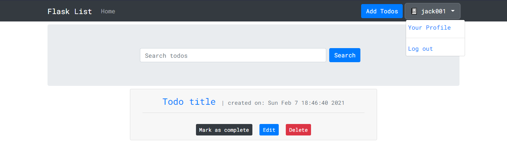

Click _**Log out**_ to log out

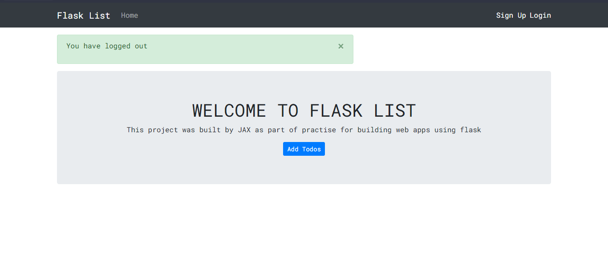